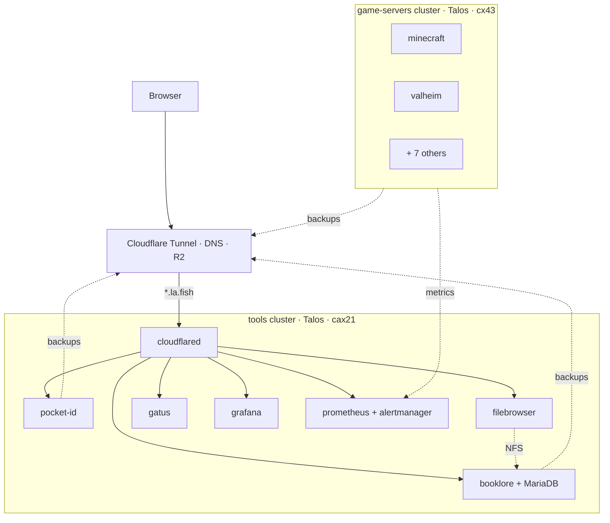

# tools

Personal Kubernetes homelab on Hetzner. GitOps-managed, no public ingress except Cloudflare Tunnel.

## Architecture

## Stack

OpenTofu · Talos Linux · Hetzner Cloud · Cloudflare (Tunnel + DNS + R2) · FluxCD · SOPS+age · Renovate

## Clusters

| Cluster | Server | State |
|---|---|---|
| `tools` | cax21 ARM | running |
| `tools-staging` | cax21 ARM | sandbox; destroyed when idle |
| `game-servers` | cx43 x86 | destroyed between play sessions |

## Apps

**tools cluster**

- pocket-id — OIDC SSO
- booklore — e-book manager
- filebrowser — shared file browser; reads booklore's books PVC over an NFS bridge (rclone serve nfs + csi-driver-nfs)
- grafana + prometheus + alertmanager
- blackbox-exporter
- gatus — status page
- wg-easy — VPN admin (parked)
- cloudflared — Cloudflare Tunnel

**game-servers cluster**

- minecraft, valheim, vrising, core-keeper, foundry, soulmask, enshrouded, palworld, satisfactory
- grafana-alloy — ships metrics to tools' Prometheus

## Infrastructure

OpenTofu state in Cloudflare R2. Per-cluster backup buckets (`<cluster>-backups`) managed in `infra/r2/`.

| Root | Manages |
|---|---|
| `infra/tools/` | tools cluster (Talos), Cloudflare Tunnel, durable Hetzner Volumes |
| `infra/tools-staging/` | tools-staging cluster |
| `infra/game-servers/` | game-servers cluster |
| `infra/r2/` | backup buckets + lifecycle rules (account-scoped, separate state) |
| `infra/modules/tools-cluster/` | shared module for tools + tools-staging |
