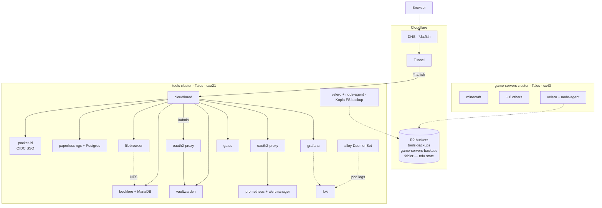

# homelab

_Personal Kubernetes homelab on Hetzner. GitOps-managed._

&nbsp;&nbsp;
&nbsp;&nbsp;
&nbsp;&nbsp;
&nbsp;&nbsp;

> **Tools cluster** ~€15/mo Hetzner cax21 + volumes

> **Games cluster** ~€0 idle; ~€15/mo cx43 when playing

## Architecture

## Stack

| Layer | Tools |
|---|---|
| **Compute & OS** |    |
| **GitOps & IaC** |     |
| **Edge & Networking** |    |
| **Identity** |   |
| **Observability** |       |
| **Backup & Storage** |    |
| **Validation** |     |

## Clusters

| Cluster | Server | State |
|---|---|---|
| `tools` | cax21 ARM | running |
| `tools-staging` | cax21 ARM | sandbox; destroyed when idle |
| `game-servers` | cx43 x86 | destroyed between play sessions |

## Apps

<b>tools cluster</b>

| | | Uptime |
|---|---|---|
| **pocket-id** | passkey OIDC SSO; auth provider for every other app |  |
| **booklore** + MariaDB | e-book manager |  |
| **paperless-ngx** + Postgres | document archive |  |
| **vaultwarden** | password manager; SSO via Pocket ID; `/admin` gated by oauth2-proxy |  |
| **grafana** | dashboards (kube-prometheus-stack) |  |
| **prometheus** | metrics; fronted by oauth2-proxy |  |
| **alertmanager** | alert routing to Telegram | |
| **loki** + **alloy** | centralized log aggregation; Alloy DaemonSet ships pod logs to Loki, Grafana queries via the Loki datasource | |
| **blackbox-exporter** | synthetic probes | |
| **gatus** | public status page at `status.la.fish` | |
| **filebrowser** | NFS bridge over booklore's PVC (rclone serve nfs + csi-driver-nfs) | |
| **velero** + node-agent | daily Kopia backups to R2 | |
| **cloudflared** | Cloudflare Tunnel | |
| **wg-easy** | VPN admin (parked at `replicas: 0`) | |

<b>game-servers cluster</b>

| | Notes |
|---|---|
| **minecraft, valheim, vrising, core-keeper, foundry, soulmask, enshrouded, palworld, satisfactory** | usually destroyed between play sessions |
| **grafana-alloy** | ships metrics to tools' Prometheus |
| **velero** | schedules per game |

## Validation & policy

Every push runs `.github/workflows/validate.yaml`:

- **kustomize build** + **kubeconform** — schema check on rendered manifests
- **conftest** with five Rego policies in `policy/`
- **tofu fmt -check** + **tofu validate** per infra root
- **renovate-config-validator** for `renovate.json5`

Gatus tracks the latest completed `main` run of this workflow and of `telegram-notify`'s CI in a **CI** group on [status.la.fish](https://status.la.fish), via the unauthenticated GitHub REST API (60 req/hr per IP — keep the 5m interval).

| Repo | Workflow | Status |
|---|---|---|
| **homelab** | `validate.yaml` |  |
| **telegram-notify** | `ci.yml` |  |

## Infrastructure

OpenTofu state in Cloudflare R2.

| Root | Manages |
|---|---|
| `infra/tools/` | tools cluster (Talos), Cloudflare Tunnel, durable Hetzner Volumes |
| `infra/tools-staging/` | tools-staging cluster |
| `infra/game-servers/` | game-servers cluster |
| `infra/r2/` | backup buckets + lifecycle rules (account-scoped, separate state) |
| `infra/modules/tools-cluster/` | shared module for tools + tools-staging |
