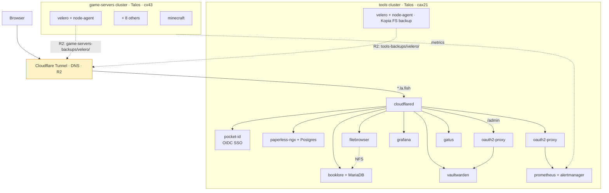

# tools

Personal Kubernetes homelab on Hetzner. GitOps-managed, no public ingress except Cloudflare Tunnel.

## Architecture

## Stack

OpenTofu · Talos Linux · Hetzner Cloud · Cloudflare (Tunnel + DNS + R2) · FluxCD · SOPS+age · Renovate

## Clusters

| Cluster | Server | State |
|---|---|---|
| `tools` | cax21 ARM | running |
| `tools-staging` | cax21 ARM | sandbox; destroyed when idle |
| `game-servers` | cx43 x86 | destroyed between play sessions |

## Apps

**tools cluster**

- **pocket-id** — passkey-based OIDC SSO; the auth provider every other app talks to
- **booklore** + MariaDB — e-book manager
- **paperless-ngx** + Postgres — document archive
- **vaultwarden** — Bitwarden-compatible password manager; SSO via Pocket ID; `/admin` gated by oauth2-proxy with `--allowed-group=admin`
- **filebrowser** — shared file browser; reads booklore's books PVC over an NFS bridge (rclone serve nfs + csi-driver-nfs)
- **grafana** + **prometheus** + **alertmanager** (kube-prometheus-stack); prometheus is fronted by **oauth2-proxy** (no public unauth surface)
- **blackbox-exporter** — synthetic probes
- **gatus** — public status page (`status.la.fish`); runs in monitoring namespace alongside alertmanager
- **velero** + node-agent — daily Kopia file-system backups to R2
- **wg-easy** — VPN admin (parked at replicas: 0)
- **cloudflared** — Cloudflare Tunnel

**game-servers cluster**

- **minecraft**, valheim, vrising, core-keeper, foundry, soulmask, enshrouded, palworld, satisfactory
- **grafana-alloy** — ships metrics to tools' Prometheus
- **velero** — schedules per game; Minecraft has an RCON quiesce hook (`save-off` / `save-all flush`)

## Validation & policy

Every push runs `.github/workflows/validate.yaml`:

- **kustomize build** + **kubeconform** — schema check on rendered manifests
- **conftest** with five Rego policies in `policy/`:
  - `environment-parity` — tools vs tools-staging ResourceSet drift
  - `secret-sops-encrypted` — every Secret in git must have a `sops:` field
  - `no-hardcoded-r2-endpoint` — R2 URL must come from `${S3_ENDPOINT_URL}` cluster-vars
  - `substitute-vars-defined` — every `${VAR}` ref must have a defined source
  - `image-explicit-tag` — no `:latest` (allow-list for self-built auto-rolling images)
- **tofu fmt -check** + **tofu validate** per infra root
- **renovate-config-validator** for `renovate.json5`

## Infrastructure

OpenTofu state in Cloudflare R2. Per-cluster backup buckets (`<cluster>-backups`) managed in `infra/r2/`.

| Root | Manages |
|---|---|
| `infra/tools/` | tools cluster (Talos), Cloudflare Tunnel, durable Hetzner Volumes |
| `infra/tools-staging/` | tools-staging cluster |
| `infra/game-servers/` | game-servers cluster |
| `infra/r2/` | backup buckets + lifecycle rules (account-scoped, separate state) |
| `infra/modules/tools-cluster/` | shared module for tools + tools-staging |
